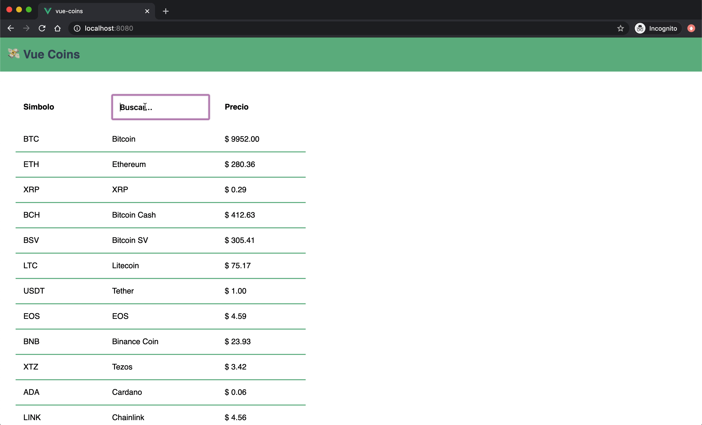
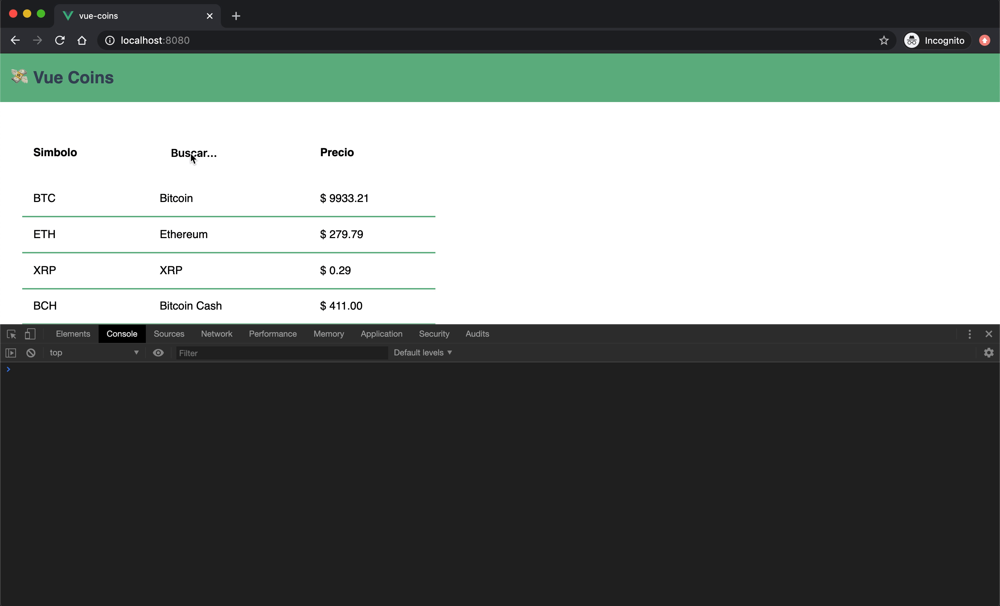

# 👀 *Computed & Watch*

En algunos casos necesitamos mostrar tanta información que el template (HTML) puede ponerse un poco engorroso. En otros casos la información no es abundante pero si el proceso para *parsearla* o formatearla. Para este tipo de problemas Vue nos ofrece dos soluciones diferentes pero parecidas: *Computed Properties* & *Watchers*.

## Computed

Las propiedades computadas son aquellas que se crean a partir de los cambios que puedan efectuarse en una o más propiedades del `vm`. Esto quiere decir, que podemos tener una propiedad dinámica cuyo valor va a calcularse cada vez que otra/s propiedad/es cambien su/s valore/s.

En este caso, vamos a usar una propiedad computada para hacer un filtro en tiempo real sobre la tabla de assets.

1. Dentro del `vm` del componente `CoinList`, vamos a agregar una propiedad llamada computed con una función llamada `filteredAssets`. Tambien vamos a agregar a `data` una propiedad llamada `search`.

```html
<script>
import { getAssets } from '@/services/coincap'

export default {
  name: 'CoinList',

  data () {
    return {
      search: '',
      assets: [],
      isLoading: true
    }
  },

  computed: {
    filteredAssets () {
      if (!this.search) {
        return this.assets
      }

      return this.assets
        .filter(a => a.name.toLowerCase().includes(this.search.toLowerCase()))
    }
  },

  created () {
    getAssets()
      .then(({ data }) => {
        this.assets = data
        this.isLoading = false
      })
  }
}
</script>
```

`filteredAssets()` como todas las *computed properties*, **son funciones que devuelven un valor**.
En este caso lo que estamos haciendo es filtrar la lista de assets en base al valor de la propiedad `search`. Como dentro de esta función estamos usando las propiedades `assets` y `search`, Vue se va a encargar de "computar" los valores y obtener un nuevo valor, cada vez que los valores de ambas variables se modifiquen.

1. Para usar esta propiedad en nuestro template vamos primero a agregar un input con la directiva `v-model` linkeada a la propiedad `search`. De esta forma, logramos que cada vez que se modifique el valor del input vamos a poder actualizar la lista de `assets` y mostrar solo los que coinciden con el valor de la búsqueda. Por otro lado tenemos que modificar la directiva `v-for` para que en lugar de usar la lista completa de assets use la nueva *computed property*.

```html
<template>
  <section tabindex="0">
    <p v-if="isLoading">Cargando...</p>
    <table v-else>
      <thead>
        <tr>
          <th>Simbolo</th>
          <th><input type="text" v-model="search" placeholder="Buscar..." aria-label="Buscar..."></th>
          <th>Precio</th>
        </tr>
      </thead>
      <tbody>
        <tr v-for="a in filteredAssets" :key="a.id">
          <td>{{ a.symbol }}</td>
          <td>{{ a.name }}</td>
          <td>$ {{ parseFloat(a.priceUsd).toFixed(2) }}</td>
        </tr>
      </tbody>
    </table>
  </section>
</template>
```

> 👌 Como habras notado, dentro de `<template>` las propiedades computadas se utilizan de la misma forma que las propiedades normales, tanto en directivas como en expresiones.



## Watchers

Los watchers tienen un comportamiento muy similar. Son funciones que se van a ejecutar cada vez que una propiedad modifique su valor. La diferencia es que estas funciones no retornan un valor sino que son simplemente observables que van a disparar ejecuciones de código. Un buen caso de uso seria ejecutar una petición HTTP cada vez que el valor de una propiedad se modifique.

Para este ejemplo vamos a crear un watcher sobre la propiedad `filteredAssets` que simplemente imprima en consola la cantidad de `assets` encontrados, cada vez que esta propiedad computada cambia.

> 👌 Los watchers pueden crearse sobre propiedades normales y sobre propiedades computadas.

1. Agregamos un objeto con el nombre `watch` dentro del `vm`.
2. Dentro del objeto creamos una función con el nombre `filteredAssets`. En el caso de los watchers se observan propiedades específicas, por lo cual el **nombre de la función watcher debe ser igual al nombre de la propiedad que queremos observar**.
3. Esta nueva función puede recibir dos argumentos: el primero es el nuevo valor de la propiedad en cuestión, el segundo es el valor anterior de esta propiedad. En el cuerpo de la función podemos poner un `console.log` que imprima la cantidad de assets encontrados usando el nuevo valor.

```js
<script>
import { getAssets } from '@/services/coincap'

export default {
  name: 'CoinList',

  data () {
    return {
      search: '',
      assets: [],
      isLoading: true
    }
  },

  computed: {
    filteredAssets () {
      if (!this.search) {
        return this.assets
      }

      return this.assets
        .filter(a => a.name.toLowerCase().includes(this.search.toLowerCase()))
    }
  },

  watch: {
    filteredAssets (newVal) {
      console.log(`Se encontraron ${newVal.length} assets`)
    }
  },

  created () {
    getAssets()
      .then(({ data }) => {
        this.assets = data
        this.isLoading = false
      })
  }
}
</script>
```

> 😛 Este watcher nos es más que un ejemplo para comprender como funciona el concepto. Una vez que termine el ejercicio podemos comentar el código ya que los mensajes en consola pueden resultar bastante molestos 🙃



___

### 📝 [Solución](https://github.com/ianaya89/vue-coins/tree/11)

[⏪](https://github.com/ianaya89/workshop-vuejs/blob/master/ex/10.md)  [⏩](https://github.com/ianaya89/workshop-vuejs/blob/master/ex/12.md)
